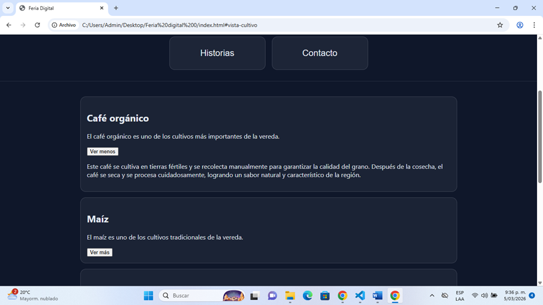
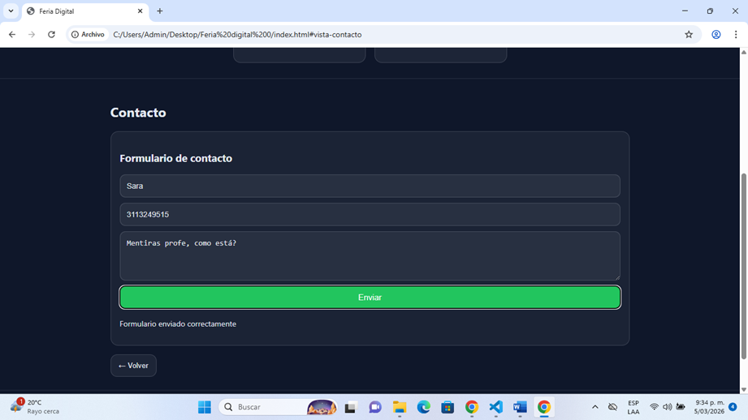
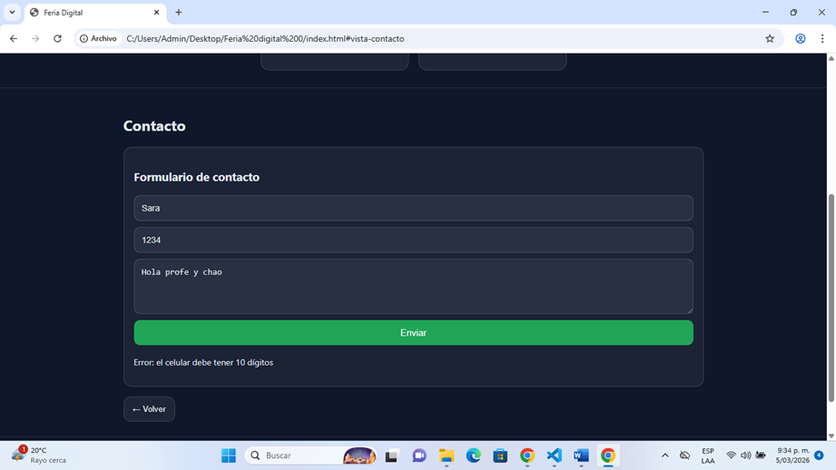
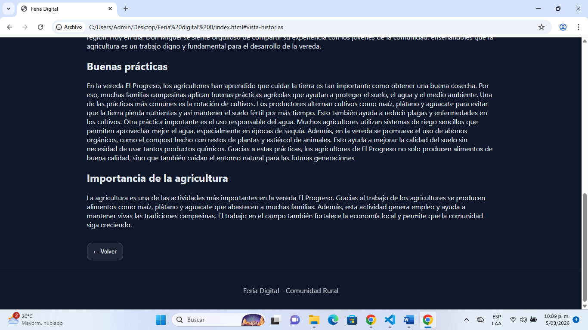
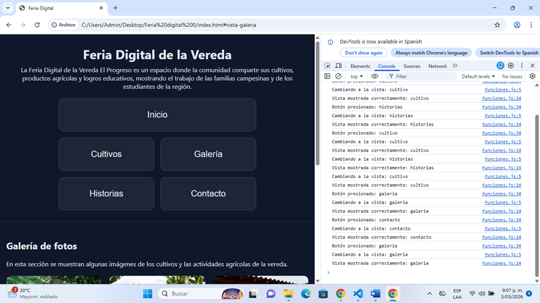

# Feria Digital de la Vereda El Progreso

## Descripción del proyecto

Este proyecto cosiste en una página web llamada Feria Digital de la Vereda El Progreso.  
La idea de la página es mostrar información sobre la comunidad rural especialmente sobre los cultivos que se producen en la vereda, las historias de los productores y algunos aspectos de la vida en la comunidad.

En la pagina se pueden encontrar diferentes secciones como:

- Cultivos
- Galería de fotos
- Historias de la comunidad
- Contacto

Cada sección muestra información relacionada con la agricultura y el trabajo de las familias campesinas de la vereda.

El objetivo principal del proyecto es aplicar los conocimientos básicos de HTML, CSS y JavaScript para crear una página web interactiva.  
También busca mostrar cómo la tecnología puede ayudar a dar a conocer la agricultura y las comunidades rurales.

Además el proyecto permite navegar entre las diferentes secciones sin recargar la página lo que hace que la experiencia sea más rápida y dinámica.

---

# Cómo ejecutar el proyecto

Para abrir el proyecto solo se necesitan unos pasos sencillos:

1. Descargar o abrir la carpeta donde está guardado el proyecto.
2. Buscar el archivo llamado index.html.
3. Hacer doble clic sobre el archivo.
4. El archivo se abrirá automáticamente en el navegador (Chrome, Edge, Firefox, etc.).
5. Una vez abierto, se podrá navegar por las diferentes secciones de la página usando los botones.

No es necesario instalar ningún programa adicional porque todo funciona directamente en el navegador.

---

# Tecnologías utilizadas

Para desarrollar esta página se utilizaron tres tecnologías principales:

**HTML**
- Se utilizó para crear la estructura de la página.
- Permite organizar las secciones, textos, imágenes y botones.

**CSS**
- Se utilizó para diseñar la apariencia de la página.
- Permite cambiar colores, tamaños, espacios, bordes y organización de los elementos.

**JavaScript**
- Se utilizó para agregar interactividad a la página.
- Permite que los botones funcionen y que algunas partes de la página cambien dinámicamente.

---

# Funcionalidades de JavaScript implementadas

Durante el desarrollo del proyecto se implementaron varias funciones en JavaScript para hacer la página más interactiva.

### Cambio de vistas sin recargar la página

Se creó una función llamada **mostrarVista()** que permite cambiar entre las secciones de la página (cultivos, galería, historias y contacto) sin tener que recargar el navegador.

Esto se hace agregando o quitando la clase **activa** a cada sección.

---

### Botones "Ver más"

En la sección de cultivos se agregaron botones llamados **Ver más**.

Estos botones permiten:

- Mostrar información adicional del cultivo.
- Ocultar nuevamente esa información cuando el usuario lo desee.

Esto se logra agregando o quitando la clase **oculto** con JavaScript.

---

### Uso de console.log()

Durante las pruebas del proyecto se utilizó **console.log()** para verificar que los eventos del programa se ejecutaran correctamente.

Por ejemplo:

- Cuando el usuario cambia de vista.
- Cuando se ejecuta una función.
- Cuando ocurre un error.

Esto ayuda a comprobar que el código está funcionando correctamente y facilita encontrar errores.

---

### Validación del formulario de contacto

En la seción de contacto se implementó una validación básica del formulario.

Las validaciones son:

- **Nombre obligatorio**
- **Celular con exactamente 10 dígitos**
- **Mensaje obligatorio con mínimo 10 caracteres**

Si algún campo no cumple con las condiciones, el sistema muestra un mensaje de error para que el usuario lo corrija.

Si todos los datos están correctos, el formulario muestra un mensaje de confirmación.

---

# Conclusión

Este proyecto permitió aplicar conocimientos básicos de desarrollo web usando **HTML, CSS y JavaScript**.

Además de aprender a crear una página web, también se practicó:

- Organización de archivos
- Uso de estilos CSS
- Manejo de eventos en JavaScript
- Validación de formularios
- Uso de la consola para detectar errores

La Feria Digital es una forma sencilla de mostrar información sobre la **agricultura y la comunidad de la vereda El Progreso**, utilizando herramientas básicas de programación web.
 Botones "ver mas"
  Validacón formulario correcto
 Validación formuario incorrecto 
 Botón "volver"
 validación con log

**Errores cometidos**
- No haber conectado index.html con estilos.css
- No haber cerrado parentesis en funciones.js
- No poner div e html y ponerlo en la etiqueta de css 
